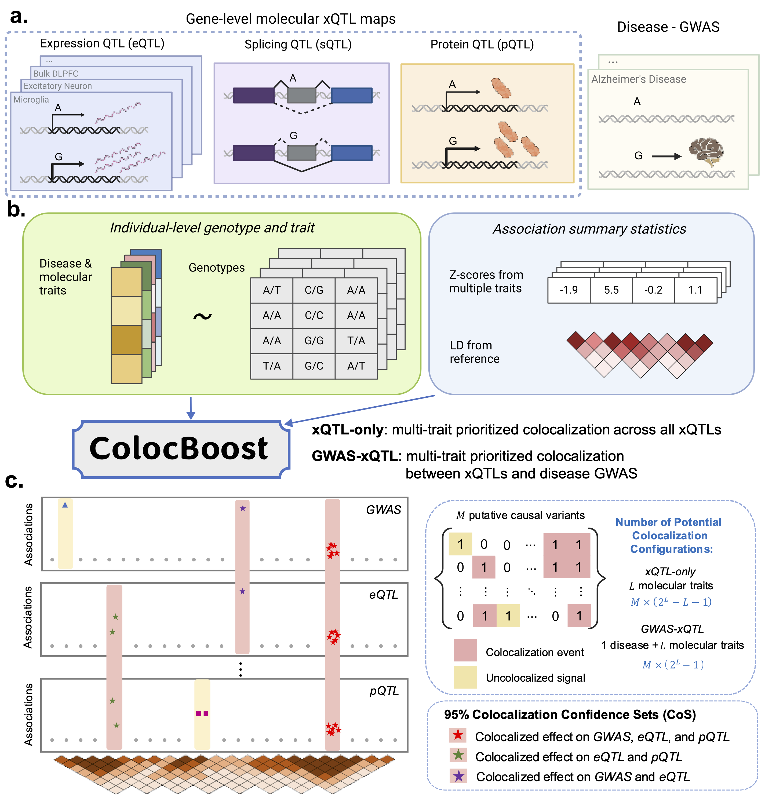

## 1.Multi-omics colocalization analysis

ColocBoost, a multi-trait colocalization analysis, i) accommodates multiple variants with shared causal genetic effects at a locus, ii) scales efficiently to tens or hundreds of traits, and iii) accurately detects colocalization events for variants with relatively weak effects. 

- Preprint: [https://www.medrxiv.org/content/10.1101/2025.04.17.25326042v1](https://www.medrxiv.org/content/10.1101/2025.04.17.25326042v1)
- Source code and R package: [https://github.com/StatFunGen/colocboost](https://github.com/StatFunGen/colocboost)
- Tutorials: [https://statfungen.github.io/colocboost/](https://statfungen.github.io/colocboost/)

## 2.Biological Network Analysis

