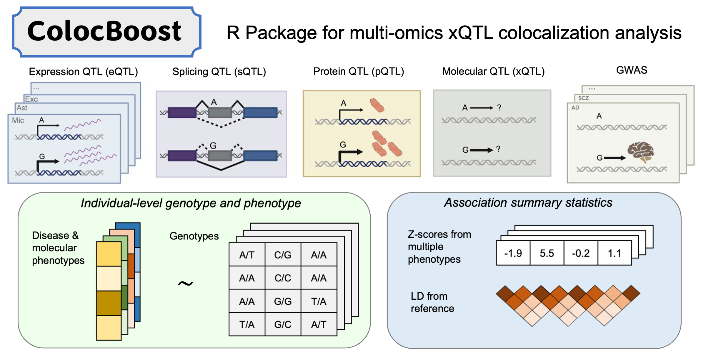

## [R/ColocBoost](https://github.com/StatFunGen/colocboost)
This R package implements ColocBoost---motivated and designed for colocalization analysis of multiple genetic association studies---as a multi-task learning approach to variable selection regression with highly correlated predictors and sparse effects, based on frequentist statistical inference. It provides statistical evidence to identify which subsets of predictors have non-zero effects on which subsets of response variables. Learn how to perform colocalization analysis with step-by-step examples. For detailed tutorials and use cases in [Tutorials](https://statfungen.github.io/colocboost/articles/index.html).

## [R/GPN](https://github.com/xueweic/GPN)
A novel method for multiple phenotype association studies by constructing a bipartite signed network, linking phenotypes and genotypes into a Genotype and Phenotype Network (GPN), which is a new insight to investigate correlation among phenotypes. The GPN can be constructed by both quantitative and qualitative traits, especially phenotypes have extremely unbalanced case-control ratios.

## [R/TGPred](https://github.com/xueweic/TGPred) and [Python/TGPred](https://github.com/tobefuture/TGPred)
R and Python software including six efficient methods for predicting target genes of a transcription factor by integrating statistics, machine learning, and optimization.

## [Python/CLCLSA](https://github.com/xueweic/CLCLSA)
A deep learning method for multi-omics integration with incomplete data by Cross-omics Linked unified embedding with Contrastive Learning and Self Attention (CLCLSA). Utilizing complete multi-omics data as supervision, the model uses cross-omics autoencoders to learn the feature representation across different types of biological data. The multi-view contrastive learning, which is used to maximize the mutual information between different types of omics, is employed before latent feature concatenation. Also, the feature-level self-attention and omics-level self-attention are employed to dynamically select the most informative features for multi-omics data integration. 